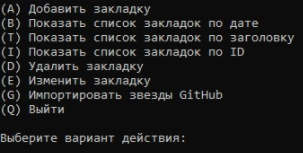

# Monomach_marks
 

<b>RU</b> 
 Консольное приложение для создания и хранения закладок. 
 Все данные хранятся в БД на Вашем компьютере. 
  
 
 Вы можете: 
 -Добавить закладку. 
 -Изменить закладку. 
 -Вывести закладки на экран, отсортировав по ID, дате добавления и заголовку. 
 -Удалить закладку. 
 
 

 
 <b>EN</b> 
 A CLI application for creating and storing bookmarks 
 All data is stored in a database on your computer. 
  
 
 You can: 
 -Add a bookmark. 
-Change the bookmark. 
 -Display bookmarks on the screen, sorted by ID, date of addition and title. 
-Delete the bookmark. 
  
